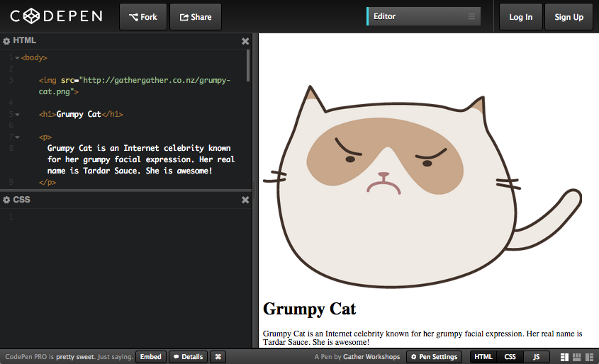

---
layout: chapter
title: Styley Design
slides:

  - class: title-slide
    content: |

      

      # Styley Design

      _Designing your content_


  - content: |

      {: width="300"}

      ## CSS With Grumpy Cat

      Open this link in a new tab: <a href="http://codepen.io/gatherworkshops/pen/yyrQpd?editors=110" target="_blank">Grumpy Cat Code</a>

      Keep it open! We are going to be using CSS
      to make it look way better.

  - content: |
      ## CodePen Editor

      

      CodePen can show us both our HTML and our CSS.

    notes: |

      The grey text at the top is a comment. It is not visible in the output.

      The white text is code. It is visible in the output.


  - content: |
      ## Grumpy Cat Example

      <p data-height="550" style="height:550px;" data-theme-id="19418" data-slug-hash="yyrQMr" data-default-tab="result" data-user="gatherworkshops" class='codepen'>See the Pen <a href='http://codepen.io/gatherworkshops/pen/yyrQMr/'>Otter Challenge Demo</a> by Gather Workshops (<a href='http://codepen.io/gatherworkshops'>@gatherworkshops</a>) on <a href='http://codepen.io'>CodePen</a>.</p>
      <script async src="//assets.codepen.io/assets/embed/ei.js"></script>

      Next we will use code to make our output look something like this.


  - content: |
      ## Classes

      To make our page look pretty, first we create a CSS class with a unique name.

      **In your CSS panel:**
      
      ```css 
      .profile-pic {
        width: 200px;
      }
      ```
      {:.big-code}

      We just created a `class` called `profile-pic`.

      This class can change the width of something on our page to be `200px`.

    notes: |

      We use CSS to write code about how objects on our page should look.

      This code says that any HTML element with the class `profile-pic` should be displayed as 200 pixels wide.

      One little trick - don't forget the dot in front of the class name in CSS!

  - content: |
      ## Applying Classes

      Find the first image tag in the HTML panel,<br> and apply the profile-pic class to it.

      **Find this line your HTML panel:**

      ```html
      
      ```

      **And change it to:**

      ```html
      
      ```

      Cartoon Grumpy Cat should now be much smaller.

    notes: |
      We can apply a CSS class to any HTML element. We can also apply the *same* class to *many* different elements on the page.

      The class name you gave your element in the HTML and the class name you use in your CSS need to match exactly. 

      There is no dot before the class name in our HTML but we _do_ need that dot in our CSS code.

  - content: |
      ## Font Styles

      There are many font options in CSS. We can create another class to try them out.

      **In your CSS panel, on a new line:**

      ```css
      .page-title {
        font-family: "Comic Sans MS";
        font-size: 50px;
        text-align: center;
        text-shadow: 5px 5px 5px rgba(0,0,0,0.5);
      }
      ```

      **In your HTML, find the h1 and apply the class:**

      ```html
      <h1 class="page-title">Grumpy Cat</h1>
      ```

    notes: |

      :)


  - content: |
      ## Block Elements

      Block elements are the "building blocks" of our website. 

      Block elements are used for layout, and can contain other elements.

    notes: |
      `header` might contain our h1 and menu bar<br>
      `section` could be an intro, gallery, or general info<br>
      `footer` might contain copyright and contact info

      Pages often have one **header**, lots of **sections** and one **footer**.


  - content: |

      ## Stuff We Covered

      - **Rule Structure**
        A design rule is made up of a target and a bunch of lines of design.
      - **Class Styles**
        A design rule can be applied to specific elements using a class name
      - **Element Styles**
        A design rule can be applied to all elements of one kind by the element name
      {:.flex-list}


  - content: |

      {: height="200" }

      ## Styley Design: Complete!

      Great, now let's get started on our own projects...

      [Take me to the next chapter!](building-layouts.html)


    notes: |

      Great! Now that we know the basics, let's get started on our own projects.


---