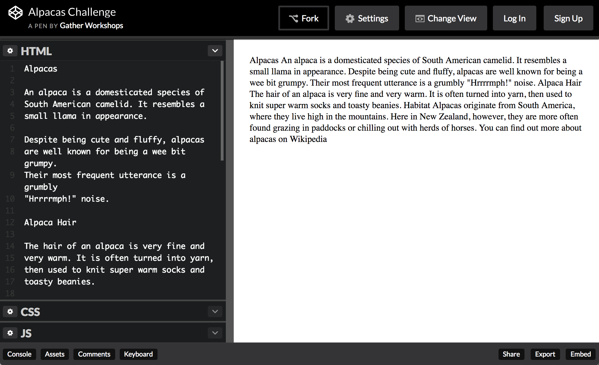

---
layout: chapter
title: Coding Content
slides:

    - class: title-slide

      content: |

        

        # Coding Content

        _Putting content on your page with HTML_

      notes: |

        Let's begin with some HTML and CSS snippets.


    - content: |

        ## HTML With Alpacas

        Open this link in a new tab: <a href="http://codepen.io/gatherworkshops/pen/KDvtC?editors=100" target="_blank">Alpacas Code</a>

        Keep it open! We are going to be using HTML
        to make it look way better.


    - content: |

        ## CodePen Editor

        

        CodePen shows us our code on the left,
        and the output on the right.

      notes: |

        The grey text at the top is a comment. It is not visible in the output.

        The white text is code. It is visible in the output.


    - content: |

        ## Alpaca Text Example

        <p data-height="550" style="height:550px;" data-theme-id="19418" data-slug-hash="gbyXgo" data-default-tab="result" data-user="gatherworkshops" class='codepen'>See the Pen <a href='http://codepen.io/gatherworkshops/pen/gbyXgo/'>Otter Challenge Demo</a> by Gather Workshops (<a href='http://codepen.io/gatherworkshops'>@gatherworkshops</a>) on <a href='http://codepen.io'>CodePen</a>.</p>
        <script async src="//assets.codepen.io/assets/embed/ei.js"></script>

        We will use code to make our output look like this.


    - content: |

        ## Headings

        Add `<h1>` and `</h1>` tags to make the `Alpacas` heading big and bold.

        ```html
        <h1>Alpacas</h1>
        ```
        {:.big-code}

        `<h1>` says "start the heading here"
        `</h1>` says "end the heading here"

      notes: |

        Let's start with some really common HTML elements.

        The first line is how we make large heading text, using the `h1` element. That's a "one" after the "h" by the way!
        
        See how the start and end of the element are written the same, except for the  extra "slash" at the end? That's a really common format in HTML.


    - content: |

        ## Subheadings

        Now use `<h2>` tags to make `Alpaca Hair` and `Habitat` big.

        ```html
            <h2>Alpaca Hair</h2>
        ```
        {:.big-code}

        `h1` is the biggest heading
        `h2` is the second biggest heading
        `h3` is the third biggest heading

        `h6` is the smallest heading


      notes: |

        Just like we used `h1` for the most important title on the page, we can use `h2` for headings which are second most important.

        The start and end of the element are still written the same, with the extra "slash" in the closing tag.


    - content: |

        ## Paragraphs

        Now use `<p>` tags to split up your paragraphs.

        ```html
        <p>
        An alpaca is a domesticated species of 
        South American camelid. It resembles a 
        small llama in appearance.
        </p>
        ```

        Put a `<p>` *before* each paragraph,
        and a `</p>` *after* each paragraph.

      notes: |

        Paragraphs of text use the `p` element.

        A paragraph of text will automatically have some space before and after it.


    - content: |

        ## Links

        Find the word `Wikipedia` in your code.

        Turn it into a link using `a` tags, like this:

        ```html
        <a>Wikipedia</a>
        ```
        {:.big-code}

        Then add the `href` attribute to the opening tag.

        ```html
        <a href="#">Wikipedia</a>
        ```
        {:.big-code}

        This turns the link blue, but we need another step to make it clickable.

      notes: |

        Links help us connect our website to the rest of the World Wide Web.

        The `a` element stands for "anchor" but you can think of it as meaning "action" if that's easier to remember. Clicking a link takes you to another web page.


    - content: |

        ## Link Attribute

        We tell the link where to go when it's clicked using `href`.

        Find your opening `<a>` tag. Add in the `href` and link.

        ```html
        <a href="http://en.wikipedia.org/wiki/Alpaca">Wikipedia</a>
        ```

        The only part we added was: 
        ```html
        href="http://en.wikipedia.org/wiki/Alpaca"
        ```

      notes: |

        The attribute `href` stands for "hyperlink reference" which is just a fancy way of saying "website address".

        The `href` attribute is what we use to tell a link where it should link to.


    - content: |
    
        ## Image Tags

        Add an `img` tag to the very bottom of your code:

        ```html
        
        ```

        **`src` stands for "source"**<br>
        Replace the `#` with a link to an image online.

        **`height` is the height of the image**<br>
        This is optional, it is the height in pixels.  


    - content: |

        ## Image Source

        Find an image online, and copy the link to it.

        Replace the `#` as the `src` value, using paste:

        ```html
        
        ```

        Find and add at least 2 more images.


    - content: |

        ## Final Result

        Your own output window should now look like this:

        <div style="height:570px" data-height="570" data-theme-id="0" data-slug-hash="gbyXgo" data-default-tab="result" data-user="gatherworkshops" class='codepen'>See the Pen <a href='http://codepen.io/gatherworkshops/pen/gbyXgo/'>gbyXgo</a> by Gather Workshops (<a href='http://codepen.io/gatherworkshops'>@gatherworkshops</a>) on <a href='http://codepen.io'>CodePen</a>.</div>
        <script async src="//assets.codepen.io/assets/embed/ei.js"></script> 


      notes: |

        If your own page doesn't look like the example, check that all your tags are correct!

        Remember most tags come in pairs:

            <h1> </h1>

            <h2> </h2>

            <p> </p>

            <a href="#"> </a>

        But images only need one tag:<br>
          
            


    - content: |

        ## Stuff We Covered

        - **Headings**
          Biggest is h1, smallest is h6, and size is based on heading importance
        - **Paragraphs**
          Split our content up into manageable pieces.
        - **Images**
          Don't have a closing tag, and use the `src` attribute to define an image.
        - **Links**
          Use the `href` attribute to link to another page on the web.
        {:.flex-list}


    - content: |

        {: height="200" }

        ## Coding Content: Complete!

        Great, now it's time to do some design...

        [Take me to the next chapter!](css-basics.html)

---