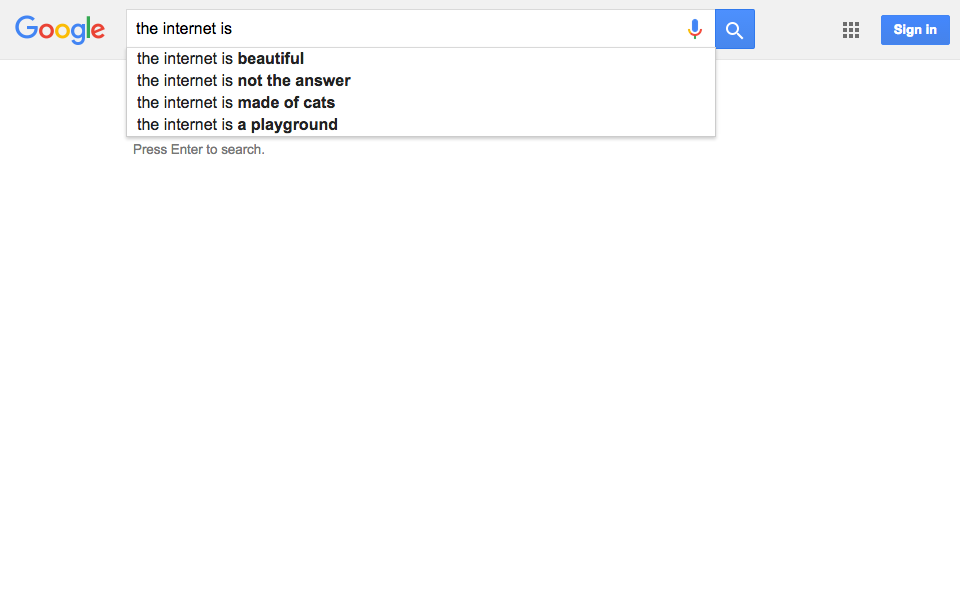

---
layout: chapter
title: Introduction
slides:

  - class: title-slide
    content: |

      

      # Building the Web
      _Create and publish your own web page_
  
    notes: |

      Welcome to Building the Web!

      This workshop is designed to introduce you to the basics of web development through a few short coding challenges.

      By the end of the workshop you will have coded and published your very own web page!

  - content: |

      ## Say hi to your mentors!

      Your mentors are here to help if you get stuck,
      and you can ask them (almost) anything!  

    notes: |

      Your mentors are super friendly, make sure to say hi.

      They actually get paid to do this stuff for a job, which is super cool.

      You can ask them for help with your code, ask them about their day job, or ask them what their favourite colour is.

      They're here to help, so ask them anything :)

  - content: |

      ## Introductions

      What is your:

      - Favourite thing?
      - Super power?
      - First name?
      {:.flex-list}

    notes: |

      Let's quickly go around the room and introduce ourselves.

      Tell us all one of your favourite things - favourite food, sport, hobby, animal, anything!

      If you could choose one super power, which would it be?

      Last of all, tell us your name.

  - content: |

      ## Schedule

      **How the Internet Works**
      **HTML and CSS Basics**

      _Morning Break_

      **Website Files**
      **Page Design and Layout**

      _Lunch Break_

      **Fancy Fonts and Gallery**
      **Go Live!**

    notes: |

      Today's workshop is arranged in six different sections.

      In the first part we will look at how the Internet works and what this means for us as coders, plus take a look at the basics of web code languages. 

      After morning tea we will start working on our own websites, so think about a topic! We'll look at the files that run a website and how to make them display what we want.

      After lunch we will add some fancy extras to our site, like some fancy fonts and an interactive gallery. Then we will publish our sites so we can share them with our friends.

  - content: |

      # What is the Internet?

      If a 5-year-old asked you "What is the Internet?"
      how would you answer?

    notes: |

      Before we start coding, let's have a think about what the Internet actually is.

      How would you explain it to a younger friend or family member?

      Could you exlain in just one sentence?

  - content: |

      ## Internet Brainstorm

      What do we use the Internet for?

      How do we access the Internet?

      Who pays for the Internet, and who gets paid?

    notes: |

      Maybe it would be easier to describe the Internet in smaller pieces. Have a go at answering these questions:

      - What do we use the Internet for?

      - How do we access the Internet?

      - Who pays for the Internet, and who gets paid?

      See if you can come up with at least one answer for each of the questions above.

  - content: |

      # The Internet  vs  The World Wide Web

      What's the difference?

    notes: |

      So, the next challenge is this: of the words you came up with, which ones relate to the Internet, and which ones relate to the World Wide Web?

      We quite often use the phrases _The Web_ and _The Internet_ to mean the same thing, but you may be surprised to learn that they are in fact quite different.

      Any idea what the difference might be?

  - content: |

      - ### The Internet
        A global system of interconnected computer networks.
        **The Internet is a network**
        **of computer networks.**
      

      - ### World Wide Web
        A system of interlinked documents, accessed via the Internet.
        **The Web is a network** 
        **of documents and media.**
      {:.flex-list}

    notes: |

      The Internet is what we use to access the World Wide Web.

      The World Wide Web is the content that we consume.

      When we create a website on the World Wide Web, we are contributing to the set of _interlinked documents_.

      When we access the Internet, we are making use of a worldwide network of _interlinked computers_.

      Can you identify which of your Internet-related words from earlier apply to the Internet, and which ones really apply to the World Wide Web?

  - content: |

      # Who owns it all?

      _Who owns the Internet?_ 
      _And who owns the Web?_

    notes: |

      So who owns the Internet?

      And who owns the web?

      Telecom? The United States? Whoever invented it?

  - content: |

      ## Who owns the Internet?

      - Nobody
      - Lots of people

       

      ## Who owns the World Wide Web?

      - Content Creators
      - You!

    notes: |

      Nobody can claim ownership of the Internet, but many people own parts of the system which make the Internet possible.

      The web is a set of documents, so nobody can claim ownership of the web either.

      You still own your own contribution though, right? 

  - content: |

      ### A web page is made of three main languages

      

    notes: |

      Websites are made of many languages, but your most basic web page, what you see in your browser, is made up of three programming languages.

      That's three different types of code, each with their own rules.

      They all work together to display what you see on the screen.

  - content: |

      ### **HTML** is the markup language

      

    notes: |

      HTML is used to define the content of a web page: the words, the pictures, the links.

      It does not define any sizes, colours or layout.

      HTML stand for HyperText Markup Language.

      This is a picture of what Google looks like when you see only the HTML - no CSS or Javascript.

  - content: |

      ### **CSS** is the style sheet language

      

    notes: |

      CSS is used to define the appearance of a web page: the colours, the sizes, the layout.

      It can be thought of as the _design language_.

      It tells our web browser how to display the HTML.

      CSS stands for _Cascading Style Sheets_.

      This is a picture of what Google looks like when you combine the HTML and CSS.

  - content: |

      ### **JavaScript** is the programming language

      

    notes: |

      JavaScript is used to define any interactivity on a web page: dropdowns, popups, anything that changes after the page is first loaded.

      It can be thought of as the _interaction language_.

      JavaScript is often known as JS for short, and is actually quite different from Java, which is another programming laguage with a similar name. Tricky!

      This is a picture of what Google looks like when you see all the HTML, CSS and JS working together.

  - content: |

      ## HTML + CSS + JS = Website!

    notes: |

      Every web site that we visit is made up of all these files.

      There are HTML files, CSS files, JavaScript files and also files in lots of other languages.

      Other programming languages are used for making more complex websites, with user accounts you can log in to, or shopping sites where you can buy things.

  - content: |

      ## Loading a Webpage

      

    notes: |

      So how does our computer load a web page over the Internet?

      First of all the client, your computer, sends a URL request like "youtube.com" to your ISP (eg. Orcon, Spark or Vodafone).

      Your ISP sends a request to the Domain Name Server, which turns the URL into an IP Address.

      Using the IP Address, your ISP can find the actual server where the web page files are stored, and send them back to your computer. 

      All these separate parts are owned by different people.

  - content: |

      ## Kinda like telephones!

      The Internet can be compared to the telephone system:

      - Nobody owns the whole thing
      - Companies do control individual parts
      - Telephone numbers and IP addresses are unique
      - There is no central control room

    notes: |

      Telephone numbers, IP addresses and street addresses are all unique locations across the whole planet.
  
      If one person's telephone stops working, or one city's phone system stops working, or even a whole country, phones will continue to work.

      The Internet is the same. It is _decentralised_ which means that it has no central control room and it can still function as a whole if some parts stop working.

  - content: |

      ### An ISP can charge extra to allow access

      ### to your favourite website

       

      e.g. Facebook, YouTube, Google

    notes: |

      What if the government or Spark decided you had to pay $10 for every YouTube video you watched?

      What if you had to pay an extra $50 a month for access to Facebook?

      Even though YouTube and Facebook themselves are free, it is possible for ISPs to know what data you are accessing from which websites, and charge you for that.

  - content: |

      ### A government can censor access to information

      e.g. North Korea and China

    notes: |

      Internet access is illegal in North Korea. Only a very few government officials have access to the Internet through a secret connection. The rest of the citizens only have access to the country's own intranet.

      This way, the government can control everything their citizens read on the Internet, and ensures that nothing is published which disagrees with the government.

      China controls all search engines to ensure that the citizens can find only the information they allow them to find.
   

   
  - content: |

      ### Chorus owns the Southern Cross Cable

      They could slow down international requests for other ISPs

    notes: |

      The Southern Cross Cable is our only connection to the outside world.

      It carries all our phone and internet communication.
  
    
  

  - content: |

      ## Your corner of the web

      By creating your own website, you are taking ownership of a small portion of the world wide web. 

      **It's all yours.**

      You can publish and share anything you like, go forth and create!

    notes: |

      Making our own website lets us shape the internet and share information with anyone in the world.

      What would you like to share? Have a think about it, because today you get to make a website about anything you like.

      Cats? Rugby? Surfing? Unicorns? Movies? Yourself? Anything goes. Have a think.
  

---