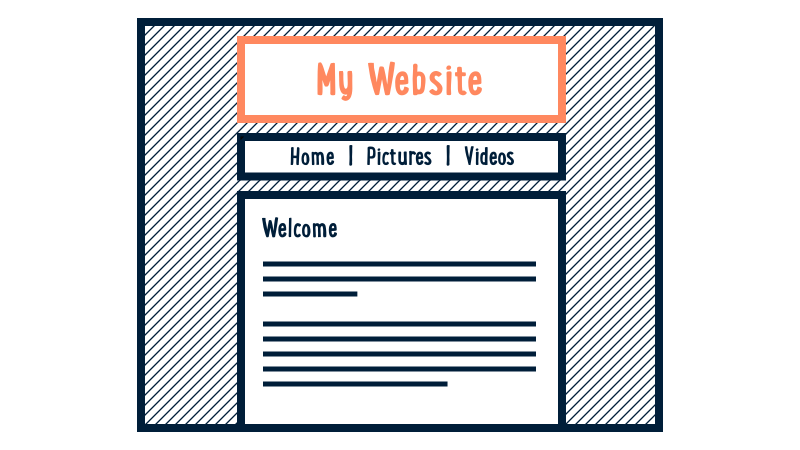

---
layout: default
title: Page Header
slides:

  - class: title-slide
    content: |

      # Custom Fonts
      _Customise your look with Google Fonts_


  - content: |

      ## Page Header

      We can use the `header` element as a container for our title and navigation.

      Start by adding the header HTML with a title:

      ```html
      <header>
        <h1>Logo Here</h1>
      </header>
      ```


    notes: |
      
      The `<header>` element has no styles already associated with it.

      It is pretty much just a see-through box which you can use to contain anything you want.

      Using a `<header>` allows us to group together all the elements which are part of the header, for easy styling using CSS.


  - content: |

      ## Header

      

      _Adding a header to your page_

    notes: |
      Our first layout element will be a header.

      The header goes at the top of the page and generally contains the name of the website.

      It might also contain a "tagline" briefly explaining what the site is for.

      Our header will be a plain box containing a simple heading.


  - content: |

      ## Header Content

      Add to `index.html`, between the `body` tags:

      ```html
      <body>
        <!-- My HTML Code Goes Here-->
        <header class="page-header">
            <h1>My Awesome Website</h1>
        </header>
      </body>
      ```
      {:data-line="1-2,6"}

      You should now see a heading on your page.
      The header box will be invisible until you add CSS.

    notes: |
  
      The `header` element has no styles already associated with it.

      It is pretty much just a see-through box which you can use to contain anything you want.

      Using a header allows us to group together all the elements which are part of the header, for easy styling using CSS.

      Add the header code to the `body` of your page.

      You should change the heading text to suit your site!


  - content: |

      ## Header Design

      Add to your `style.css`:

      ```css
      .page-header {
          background-color: #222222;
          color: #FFFFFF;
          padding: 20px;
      }
      ```

      This code will give your header a dark grey background,
      white text and 20px of spacing around the inside edge.

    notes: |
      Our sample styles show how you can add a background colour to your header, change the text colour, and get the stuff inside the header to be pushed away from the edges a bit.

      You don't have to have a background colour on your header - if you want to get rid of it, just delete that line completely!


  - content: |

      ## Header Ideas

      <iframe height='450' scrolling='no' src='//codepen.io/gatherworkshops/embed/RPLvgb/?height=450&theme-id=16068&default-tab=result' frameborder='no' allowtransparency='true' allowfullscreen='true' style='width: 100%;'>See the Pen <a href='http://codepen.io/gatherworkshops/pen/RPLvgb/'>Header Examples</a> by Gather Workshops (<a href='http://codepen.io/gatherworkshops'>@gatherworkshops</a>) on <a href='http://codepen.io'>CodePen</a>.
      </iframe>

      Take a few minutes to make your header
      look how you want it.

    notes: |
      There are heaps of different header styles you could use.

      Your header could be full width, or centered, or have no background at all.

      It could be tall or small, with big text or little text, it's all up to your imagination!

      The links on this slide have a variety of different header styles you could try out. Click the links to open up the code examples in Codepen.


  - content: |

      ## Header Styles

      Add some style to our `header` container.

      ```css
      header {
        background-color: #222222;
        color: #FFFFFF;
        padding: 20px;
      }
      ```

    notes: |
      Our sample styles show how you can add a background colour to your header, change the text colour, and get the stuff inside the header to be pushed away from the edges a bit.

      You don't have to have a background colour on your header if you don't want to - you can just delete that line completely!


  - content: |

      ## Google Fonts

      For a simple logo design, we can start by choosing a nice font from <a href="http://google.com/fonts" target="_blank">Google Fonts</a> then clicking the "Quick Use" button.

      


    notes: |
      Have a browse in the Google Fonts directory and pick a font you like.

      There are some filtering option down the left hand side if you want some more control over your search. 

      You can even change the "Grumpy Wizards" text to instead be the name of your web page. That might be helpful!

      Once you've chosen a font, click its "Quick Use" button which is the little sideways arrow inside a square.


  - content: |

      ## Adding the font to your site

      On the "Quick Use" page, look for step 3.

      

      Copy that piece of HTML code<br> 
      and put it between your site's `<head>` tags.

      It should go on the line before the link to your own stylesheet.


    notes: |
      The piece of code we add to our site's `head` is just a link to some special CSS on Google's web server.

      Google is providing us a CSS stylesheet that we can link to so that we don't have to write a whole lot of extra code ourselves to correctly embed the font in our site.


  - content: |

      ## Using the font in your CSS

      Further down the "Quick Use" page you'll find step 4.

      

      This is an example of the CSS you can now use to apply the font to elements on your page.


  - content: |

      ## Applying the font to our header

      In our case, we'll be adding the font to our `<h1>` element.

      ```css
      h1 {
        font-family: 'Pacifico', cursive;
      }
      ```

      Make sure to use your own font's name instead of "Pacifico"!


  - content: |

      ## Title Design

      Once our font is decided, we can tweak some other options:

      ```css
      h1 {
        font-family: 'Pacifico', cursive;
        margin: 0;
        font-size: 40px;
        color: #FFFFFF;
      }
      ```


  - content: |

      {: height="200" }

      ## Page Header: Complete!

      Great, now let's explore where we'll build our own site...

      [Take me to the next chapter!](welcome-section.html)


    notes: |

      Great! Now that we know the basics, let's get started on our own projects.


---