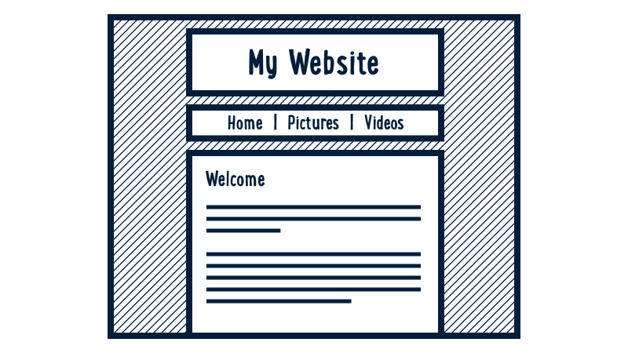
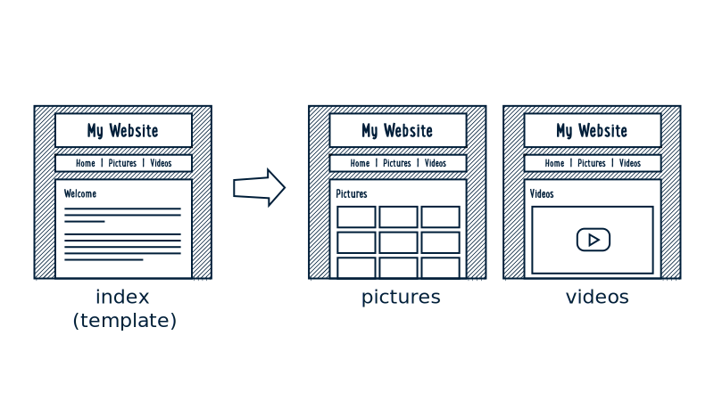
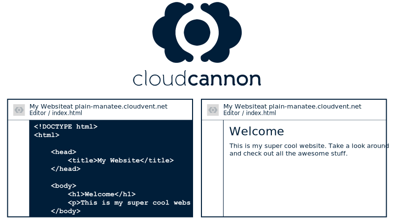
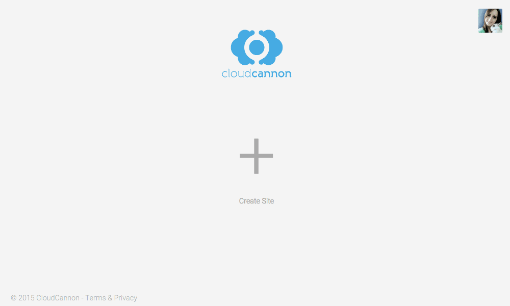
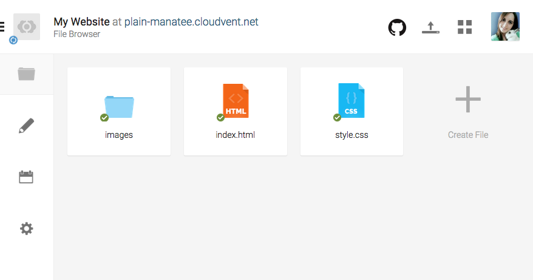
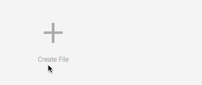
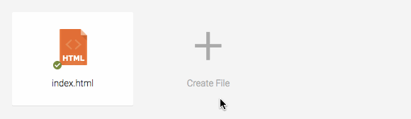
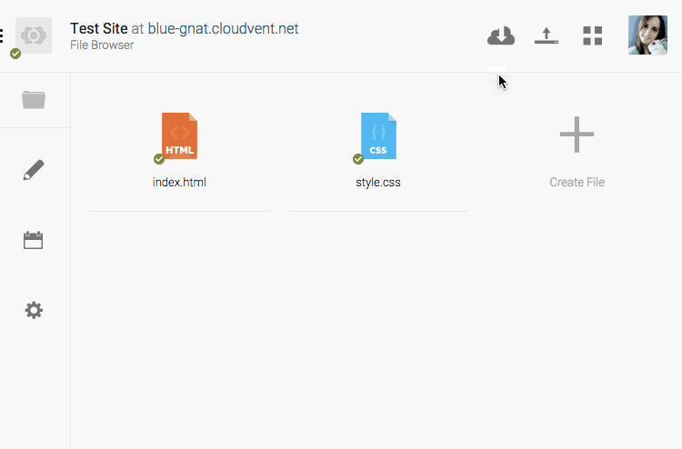
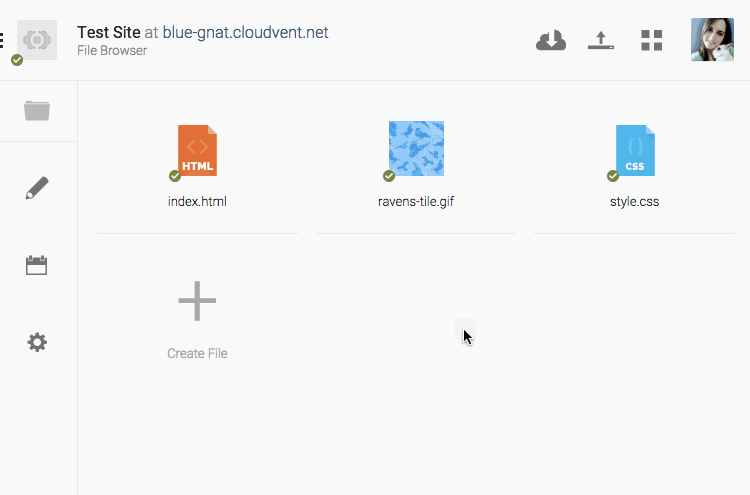

---
layout: chapter
title: Site Setup
slides:

  - class: title-slide
    content: |

      

      # Building Layouts
      _Design a theme for your site_ 


  - content: |

      ## Page Layout Design

      

      _This is what our page layout will look like_


    notes: |
  
      We will be designing a very simple page layout.

      At the top of our layout will be a header. This will contain our site heading and menu bar.

      Below the header will be a content section. This will contain all of our content for each page.


  - content: |

      ## Using a Layout

      

      _We can copy our layout to make more pages_


    notes: |

      Once we have our page layout set up, we will be able to use it to make more pages.

      We will design what our site should look like using our `index.html`, then copy it for each additional page in our website.


  - content: |

      

      _Cloud Cannon lets us edit our code and preview our site_

    notes: |
  
      Cloud Cannon is an online website editor. We will use it to edit our code and also see a live preview of what it looks like.

      It's a free service and you can even log in from home.


  - content: |

      ## Create a New Project

      {:width="100%"}

      _In CloudCannon, click "Create Site" and make a project_

    notes: |
  
      You should already have a CloudCannon account set up. If not, create one now.

      Log in to CloudCannon and create a new project.

      Name your project whatever you like, for example "My Website".


  - content: |

      ## Site Template

      {:width="100%"}

      _We will create images, index and style in our project folder_

    notes: |
  
      Congratulations, you now have a brand new empty website! 

      We need to add two files and one folder to our Cloud Cannon dashboard.

      Once we are done, we will have `index.html`, `style.css` and an `images` folder.


  - content: |

      ## Template Files


      - {:width="50%"}
        **images**
        All your images go in this folder.
      - {:width="50%"}
        **index.html**
        HTML code for your home page.
      - {:width="50%"}
        **style.css**
        CSS code for your whole website.
      {:.flex-list}


    notes: |
  
      The `images` folder is where you should upload any images you want to use in your website.

      The `index.html` contains all the HTML code for your home page. If you want to add content to your home page, you would edit this file.

      The `style.css` contains all the CSS code for your whole website. If you want to change how anything looks on any page, you would edit this file.


  - content: |

      ## Create Index Page

      {:width="100%"}

      _Create index.html in your dashboard_

    notes: |

      In your dashboard, click "Create File" and call it `index.html`.

      The `index` page is where you put all of the HTML code for your website's home page.

      Your home page needs to be called `index.html` so that your web browser can load it automatically.

      When you add more pages, you can call the extra ones whatever you like, but your home page should always be called `index.html`!


  - content: |

      ## Index Page Starter Code

      ```html
      <!DOCTYPE html>
      <html>

          <!-- head only used by the browser -->
          <head>
              <title>My Page Title</title>
              <link rel="stylesheet" href="style.css">
          </head>

          <!-- body contains the visible page content -->
          <body>
              <!-- My HTML Code Goes Here-->
          </body>
      
      </html>
      ```

      Copy this HTML code into your index.html
      {:.checkpoint}


    notes: |

      Click on your `index.html` to open it up.

      Click on the "Code Editor" button at the top right of CloudCannon. This opens the code editor screen for your page.

      Copy the code from this slide into your code editor and save.

      The first line contains the `doctype` - this tells your web browser that the file is an web page using the latest version of HTML.

      The opening and closing `html` tags wrap around all of the html code in the page.


  - content: |

      ## HTML Head

      ```html
      <!DOCTYPE html>
      <html>

          <!-- head only used by the browser -->
          <head>
              <title>My Page Title</title>
              <link rel="stylesheet" href="style.css">
          </head>

          <!-- body contains the visible page content -->
          <body>
              <!-- My HTML Code Goes Here-->
          </body>
      
      </html>
      ```
      {:data-line="1-4, 9-15"}

      _The head contains a browser tab **title** and a CSS file **link**_


    notes: |

      The `head` section of a web page contains information about your page. It _doesn't_ contain anything which is actually visible on the page.

      Be careful, `head` and `header` are two very different tags!

      The `title` is what shows up in your browser tab.

      The `link` is to the stylesheet which will contain our CSS code.

      You won't be able to see your title in CloudCannon.


  - content: |

      ## HTML Body

      ```html
      <!DOCTYPE html>
      <html>

          <!-- head only used by the browser -->
          <head>
              <title>My Page Title</title>
              <link rel="stylesheet" href="style.css">
          </head>

          <!-- body contains the visible page content -->
          <body>
              <!-- My HTML Code Goes Here-->
          </body>
      
      </html>
      ```
      {:data-line="1-10, 14-15"}

      _All of our page content HTML goes between the body tags_

    notes: |

      Further down your `index.html` you will find the body tags.

      Everything we want to be visible on our page will go between these two tags.

      All HTML code you add to your page should go _after_ the opening body tag and _before_ the closing body tag.

      There are some special cases, but if they come up the instructions will make it very clear.


  - content: |

      ## Create Stylesheet

      {:width="100%"}

      _Create style.css in your dashboard_

    notes: |

      In your dashboard, click "Create File" and call it `style.css`.

      The `style.css` file is where you put all of the CSS code for your whole website. All of your website's pages share a single CSS file.

      When you add more pages you don't need to add any more CSS files. The same design rules should apply to all pages in your website, so they can be shared.


  - content: |

      ## Choose a Background Type


      - {:height="220"}
        **Tiled**
        A smaller image which repeats
        to fill the whole page.
      - {:height="220"}
        **Full-screen**
        A large image which stretches
        to fill the whole page.
      {:.flex-list}

      _Right-click an image and "Save Image As..."_


    notes: |

      A page background can really set the tone of a website, so let's start with that.

      You can choose between a tiled or a full-screen background for your website.

      Download one of the same images from the slide to get started. You can replace it with your own image once you've got it working.

      The next slide has example code for tiled backgrounds, and the slide after it has example code for a full-screen background.

      Choose one or the other for your site.


  - content: |

      ## Upload Background Image

      {:width="80%"}

      _Upload the background image to CloudCannon_

    notes: |

      Upload your background image to Cloud Cannon.

      To use an image in our website, it's best if we upload as part of the project.

      If we just link to the image somewhere else on the Internet, there is no guarantee that the owner of the image won't delete it, move it or rename it, which would stop it from showing up on our own website.


  - content: |

      ## Move Background to Images Folder

      {:width="80%"}

      _Use the image options to "Move to new folder"_

    notes: |

      All images in our website should be stored in an `images` folder.

      CloudCannon has a design flaw where you can't create an empty folder.

      To get around this, click on your background image's options and choose "Move to new folder".

      Call the new folder "images" - CloudCannon will create the folder and move your background image inside it.


  - content: |

      ## Tiled Background

      If you want a repeating background, use this code.

      Add to your `style.css`:

      ```css
      html {
          background-image: url('images/ravens-tile.gif');
      }
      ```

      Make sure to choose an image which tiles nicely!

    notes: |
      To make a tiled background, we need some very basic CSS.
      
      Put the CSS code for the tiled background into your `style.css` file.
      
      We are adding the background to our `html` element, because that element contains everything else on the page. Adding a background to it will make the background fill up all the space behind everything else on the page.


  - content: |

      ## Full-Screen Background

      If you'd like a full-screen background, use this code.

      Add to your `style.css`:

      ```css
      html {
          background-image: url('images/tree-cover.jpg');
          background-size: cover;
          background-attachment: fixed;
      }
      ```

      Make sure to choose a nice large image!

    notes: |
      To make a full screen background, we need to add two extra lines.

      We still use `background-image` in the same way, but we also add `background-size` and `background-attachment`.

      `background-size: cover;` tells the CSS to `cover` the whole html elements with the picture. It stretches the image to fit.

      `background-attachment: fixed;` tells the CSS to make page content move over top of the background, and keep the background `fixed` in one place. 


  - content: |

      ## Background Ideas

      <iframe height='450' scrolling='no' src='//codepen.io/gatherworkshops/embed/rVzZRp/?height=450&theme-id=16068&default-tab=result' frameborder='no' allowtransparency='true' allowfullscreen='true' style='width: 100%;'>See the Pen <a href='http://codepen.io/gatherworkshops/pen/rVzZRp/'>rVzZRp</a> by Gather Workshops (<a href='http://codepen.io/gatherworkshops'>@gatherworkshops</a>) on <a href='http://codepen.io'>CodePen</a>.
      </iframe>

      _Take a few minutes to make your background_
      _look how you want it._


    notes: |

      There are many ways to use a background to enhance your site.

      You might choose to use a design which is plain or busy, dull or colourful, animated or static.

      Have a think about the theme of your site and what sort of background would suit best.

      The links on this slide have a variety of different image styles you could use.


  - content: |

      {: height="200" }

      ## Building Layouts: Complete!

      Now let's add some more sections to our page...

      [Take me to the next chapter!](page-header.html)


    notes: |

      Using HTML and CSS, you've now made
      a whole web page!


---