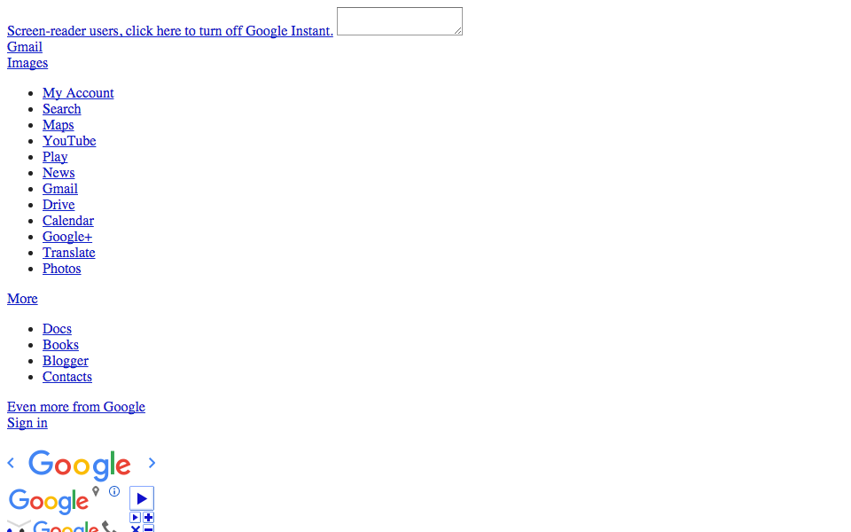

---
layout: default
title: Web Languages
slides:

  - class: title-slide
    content: |

      # Web Languages
      _How we create using code_

  - content: |

      ### A web page is made of three main languages

      {:height="350"}

    notes: |

      Websites are made of many languages, but your most basic web page, what you see in your browser, is made up of three programming languages.

      That's three different types of code, each with their own rules.

      They all work together to display what you see on the screen.

  - content: |

      ### **HTML** is the markup language

      {:height="350"}

      HTML is used to define the content of a web page.

    notes: |

      HTML is used to define the content of a web page: the words, the pictures, the links.

      It does not define any sizes, colours or layout.

      HTML stand for HyperText Markup Language.

      This is a picture of what Google looks like when you see only the HTML - no CSS or Javascript.

  - content: |

      ### **CSS** is the style sheet language

      {:height="350"}

      CSS is used to define the design of a web page.

    notes: |

      CSS is used to define the appearance of a web page: the colours, the sizes, the layout.

      It can be thought of as the _design language_.

      It tells our web browser how to display the HTML.

      CSS stands for _Cascading Style Sheets_.

      This is a picture of what Google looks like when you combine the HTML and CSS.

  - content: |

      ### **JavaScript** is the programming language

      {:height="350"}

      JavaScript is used to define the interactions of a web page.

    notes: |

      JavaScript is used to define any interactivity on a web page: dropdowns, popups, anything that changes after the page is first loaded.

      It can be thought of as the _interaction language_.

      JavaScript is often known as JS for short, and is actually quite different from Java, which is another programming laguage with a similar name. Tricky!

      This is a picture of what Google looks like when you see all the HTML, CSS and JS working together.

  - content: |

      ## HTML + CSS + JS = Website!

      You already know two of these, woohoo!

    notes: |

      Every web site that we visit is made up of all these files.

      There are HTML files, CSS files, JavaScript files and also files in lots of other languages.

      Other programming languages are used for making more complex websites, with user accounts you can log in to, or shopping sites where you can buy things.

  
  - content: |

      ## Challenge

      **Design your own "Breaking News" item:**

      - Go to the [New Zealand Herald](http://nzherald.co.nz){: target="_blank"} site
      - Click on today's top story
      - Right click on the story's title and "Inspect Element"
      - Edit the headline to make your own news!

    notes: |

      No notes

  - content: |

      ## Extra Super Challenge
      
      **On your news page, try these too:**

      - Modify the paragraph text to match your headline
      - Change the image source to link to a different image
      - Change the background colour by editing the CSS

    notes: |

      No notes

  - content: |

      {: height="200"}

      ## Web Languages: Complete!

      Next we'll take a quick look at how the Internet itself works...

      [Take me to the next chapter!](infrastructure.html)

    notes: |

      Next we'll take a quick look at how the Internet itself works...

---