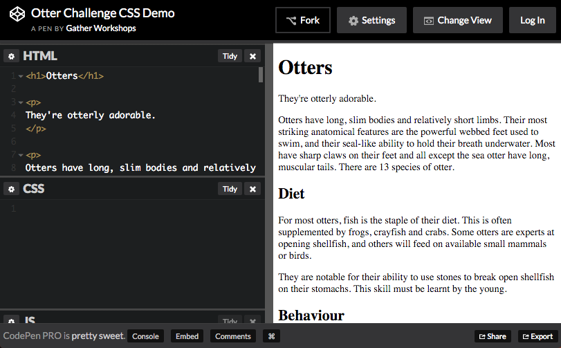

---
title: Styley Design
slides:

    - class: title-slide

      content: |

        # Styley Design
        _Making things pretty with CSS_


      notes: |

        :)


    - content: |

        ## Otter Page Design Demo

        <p data-height="550" style="height:550px;" data-theme-id="19418" data-slug-hash="BjEOVj" data-default-tab="result" data-user="gatherworkshops" class='codepen'>See the Pen <a href='http://codepen.io/gatherworkshops/pen/BjEOVj/'>Otter Challenge CSS Demo</a> by Gather Workshops (<a href='http://codepen.io/gatherworkshops'>@gatherworkshops</a>) on <a href='http://codepen.io'>CodePen</a>.</p>
        <script async src="//assets.codepen.io/assets/embed/ei.js"></script> 

        In this chapter we'll use code to apply some really slick design.


    - content: |

        ## Naming Things

        Find the `h1` and add the class `pageHeading`

        ```html
        <h1 class="pageHeading">Otters</h1>
        ```
        {:.big-code}

        We can now design the heading using its class name


    - content: |

        ## Open the CSS Panel

        
        
        Design code is written in the CSS panel in CodePen.


    - content: |

        ## Writing a Rule

        ```css
        .pageHeading {
          color: steelblue;
        }
        ```
        {:.big-code}

        We create one design rule for each class name we make up.
        Make sure to check your spelling of "color"!

        Your page heading should now be a grey-blue colour.
        {:.checkpoint}


    - content: |

        ## Font Options

        ```css
        .pageHeading {
          color: steelblue;
          font-family: Trebuchet MS;
          font-size: 80px;
        }
        ```
        {:.big-code data-line="1-2, 5" }

        Many lines of design can be added to a single rule.

        Your heading should now be large and a plain font.
        {:.checkpoint}


    - content: |

        ## Text Design Options

        ```css
        .pageHeading {
          color: red;
          font-family: Trebuchet MS;
          font-size: 80px;
          text-align: center;
          text-shadow: 3px 3px 3px black;
        }
        ```
        {:.big-code data-line="1-4, 7" }

        You can also use CSS to align and decorate your text.

        Your heading should be centered with a drop shadow.
        {:.checkpoint}


    - content: |

        ## Identify the Tagline

        ```html
        <p class="tagline">
        They're otterly adorable.
        </p>
        ```
        {:.big-code}

        Follow the same process to design the tagline under your heading.

        Find the tagline paragraph and add a class name.
        {:.checkpoint} 


    - content: |

        ## Create a matching design rule

        ```css
        .tagline {
          color: purple;
          font-family: Comic Sans MS;
          font-size: 25px;
          font-weight: bold;
          text-align: center;
        }
        ```
        {:.big-code}

        In your CSS panel, create a new rule for the tagline.

        Your tagline should be big, bold, purple and Comic Sans.
        {:.checkpoint}


    - content: |

        ## Spacing Around Elements

        ```css
        .pageHeading {
          color: red;
          font-family: Trebuchet MS;
          font-size: 80px;
          text-align: center;
          text-shadow: 3px 3px 3px black;
          margin-bottom: 0;
        }

        .tagline {
          ...
          margin-top: 0;
        }
        ```
        {:data-line="1-6, 8-11, 17" }

        Move your tagline closer to your page heading 
        by changing the margin on both elements.

        Your tagline should be much closer to your page heading.
        {:.checkpoint}


    - content: |

        ## Challenge: Design your Subheadings

        Make a new design rule called `subheading` 
        and apply it to all three subheadings.

        Base your subheading design on your page heading style.
        {:.checkpoint}


    - content: |

        ## Styling based on Element Type

        ```css
        p {
          color: darkblue;
          font-family: Verdana;
          font-size: 16px;
          line-height: 150%;
        }
        ```
        {:.big-code}

        We can style all paragraphs at the same time.

        Notice there is no dot in front of the rule name
        when styling elements by their tag name!

        Your paragraphs should be blue with higher line spacing.
        {:.checkpoint}


    - content: |

        ## Styling all Images

        ```css
        img {
          margin-right: 10px;
          margin-bottom: 10px;
          border-style: solid;
          border-width: 5px;
          border-color: white;
          box-shadow: 5px 5px 5px black;
        }
        ```
        {:.big-code}

        We can use the same approach to design all images at once.

        Your images should all have a white border and shadow.
        {:.checkpoint}


    - content: |

        ## Final Result

        <p data-height="550" style="height:550px;" data-theme-id="19418" data-slug-hash="BjEOVj" data-default-tab="result" data-user="gatherworkshops" class='codepen'>See the Pen <a href='http://codepen.io/gatherworkshops/pen/BjEOVj/'>Otter Challenge Demo</a> by Gather Workshops (<a href='http://codepen.io/gatherworkshops'>@gatherworkshops</a>) on <a href='http://codepen.io'>CodePen</a>.</p>
        <script async src="//assets.codepen.io/assets/embed/ei.js"></script> 

        Your own output should now look something like this.
        {:.checkpoint}


    - content: |

        ## Stuff We Covered

        - **Rule Structure**
          A design rule is made up of a target and a bunch of lines of design.
        - **Class Styles**
          A design rule can be applied to specific elements using a class name
        - **Element Styles**
          A design rule can be applied to all elements of one kind by the element name
        {:.flex-list}


    - content: |

        {: height="200" }

        ## Styley Design: Complete!

        Great, now a wee bit about layout...

        [Take me to the next chapter!](layout-basics.html)


      notes: |

        Great! Now that we know the basics, let's get started on our own projects.

---