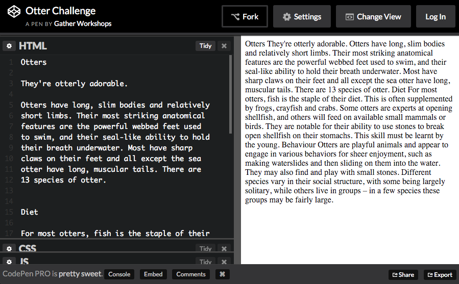

---
layout: chapter
title: Coding Content
slides:

    - class: title-slide

      content: |

        

        # Coding Content
        _Using HTML to construct page content_

      notes: |

        :)


    - content: |

        ## HTML With Otters

        Open this link in a new tab: <a href="http://codepen.io/gatherworkshops/pen/RrvbzY?editors=1000" target="_blank">Otter Challenge</a>

        Keep it open! We are going to be using HTML
        to make it look way better.


    - content: |

        ## CodePen Editor

        

        CodePen shows us code on the left, and output on the right.

      notes: |

        The grey text at the top is a comment. It is not visible in the output.

        The white text is code. It is visible in the output.


    - content: |

        ## Otter Page Demo

        <p data-height="550" style="height:550px;" data-theme-id="19418" data-slug-hash="qbgBOx" data-default-tab="result" data-user="gatherworkshops" class='codepen'>See the Pen <a href='http://codepen.io/gatherworkshops/pen/qbgBOx/'>Otter Challenge Demo</a> by Gather Workshops (<a href='http://codepen.io/gatherworkshops'>@gatherworkshops</a>) on <a href='http://codepen.io'>CodePen</a>.</p>
        <script async src="//assets.codepen.io/assets/embed/ei.js"></script> 

        Using code, we will transform our output to look like this.

    - content: |

        ## Headings

        Add heading tags before and after "Otters" on the first line.

        ```html
        <h1>Otters</h1>
        ```
        {:.big-code}

        `<h1>` says "start the heading here"
        `</h1>` says "end the heading here"

        Your "Otters" heading should now be big and bold.
        {:.checkpoint}


      notes: |

        Let's start with some really common HTML elements.

        The first line is how we make large heading text, using the `h1` element. That's a "one" after the "h" by the way!
        
        See how the start and end of the element are written the same, except for the  extra "slash" at the end? That's a really common format in HTML.


    - content: |

        ## Subheadings

        Now make `Diet` and `Behaviour` into subheadings.

        ```html
        <h2>Diet</h2>
        ```
        {:.big-code}

        `h1` is the main page heading
        `h2` is a subheading under an h1


      notes: |

        Just like we used `h1` for the most important title on the page, we can use `h2` for headings which are second most important.

        The start and end of the element are still written the same, with the extra "slash" in the closing tag.


    - content: |

        ## Paragraphs

        Now use `<p>` tags to split up your paragraphs.

        ```html
        <p>
        Otters have long, slim bodies and relatively 
        short limbs. Their most striking anatomical 
        features are the powerful webbed feet used 
        to swim, and their seal-like ability to hold 
        their breath underwater.
        </p>
        ```

        Put a `<p>` *before* each paragraph,
        and a `</p>` *after* each paragraph.

      notes: |

        Paragraphs of text use the `p` element.

        A paragraph of text will automatically have some space before and after it.


    - content: |

        ## Create a new subheading

        At the bottom of your code, add a new subheading called "Photos"

        ```html
        <h2>Photos</h2>
        ```
        {:.big-code}

        We will add a series of images below this heading.


    - content: |
    
        ## Image Tags

        Add an `img` tag to the very bottom of your code:

        ```html
        
        ```
        {:.big-code}

        **`src` stands for "source"**
        Replace the `#` with a link to an image online.

        **`height` is the height of the image**
        This is optional, it is the height in pixels.  


    - content: |

        ## Image Source

        Find an image online, and copy the link to it.

        Replace the `#` as the `src` value, using paste:

        ```html
        
        ```
        {:.big-code}

        Find and add at least two more images.
        {:.checkpoint}


    - content: |

        ## Final Result

        <p data-height="550" style="height:550px;" data-theme-id="19418" data-slug-hash="qbgBOx" data-default-tab="result" data-user="gatherworkshops" class='codepen'>See the Pen <a href='http://codepen.io/gatherworkshops/pen/qbgBOx/'>Otter Challenge Demo</a> by Gather Workshops (<a href='http://codepen.io/gatherworkshops'>@gatherworkshops</a>) on <a href='http://codepen.io'>CodePen</a>.</p>
        <script async src="//assets.codepen.io/assets/embed/ei.js"></script> 

        Your own output should now look something like this.
        {:.checkpoint}


      notes: |

        If your own page doesn't look like the example, check that all your tags are correct!

        Remember most tags come in pairs:

            <h1> </h1>

            <h2> </h2>

            <p> </p>

            <a href="#"> </a>

        But images only need one tag:<br>
          
            

    - content: |

        ## Stuff We Covered

        - **Headings**
          Biggest is h1, smallest is h6, and size is based on heading importance
        - **Paragraphs**
          Split our content up into manageable pieces.
        - **Images**
          Don't have a closing tag, and use the `src` attribute to define an image.
        {:.flex-list}


    - content: |

        {: height="200" }

        ## Coding Content: Complete!

        Great, now it's time to do some design...

        [Take me to the next chapter!](css-basics.html)


      notes: |

        :)

---